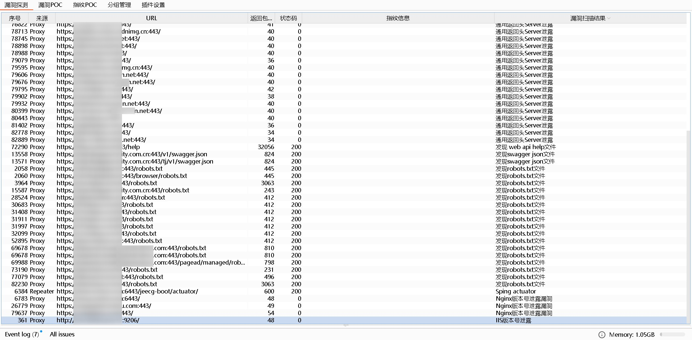
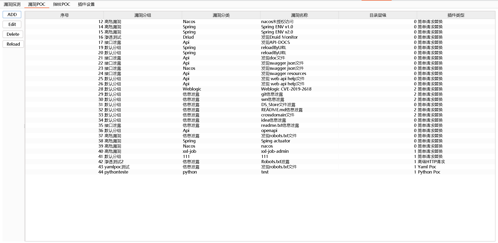
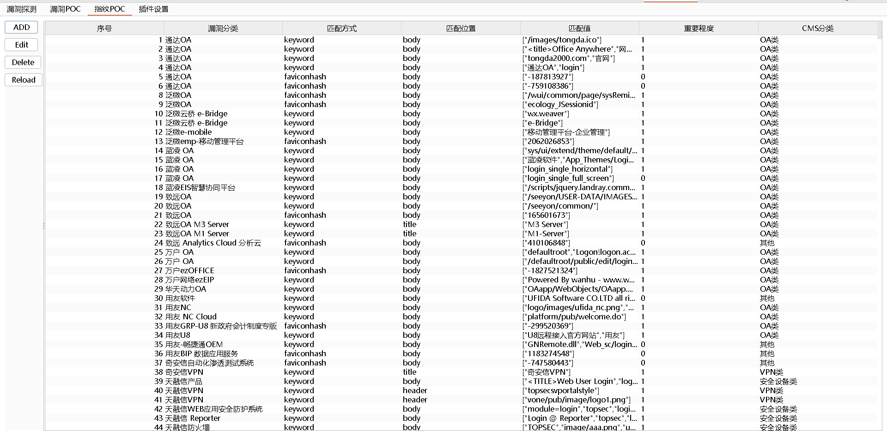
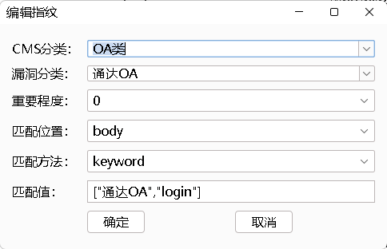
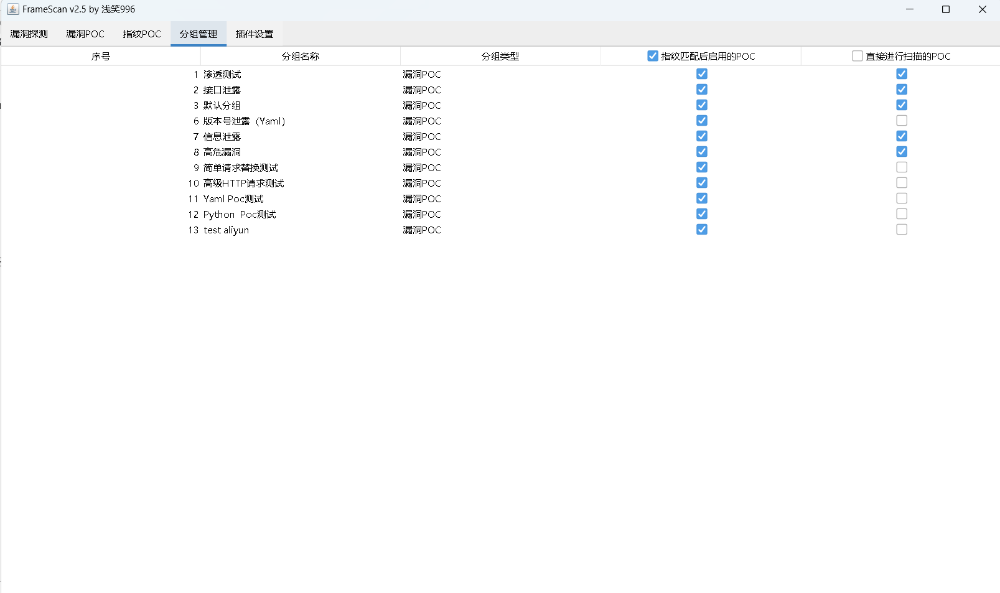
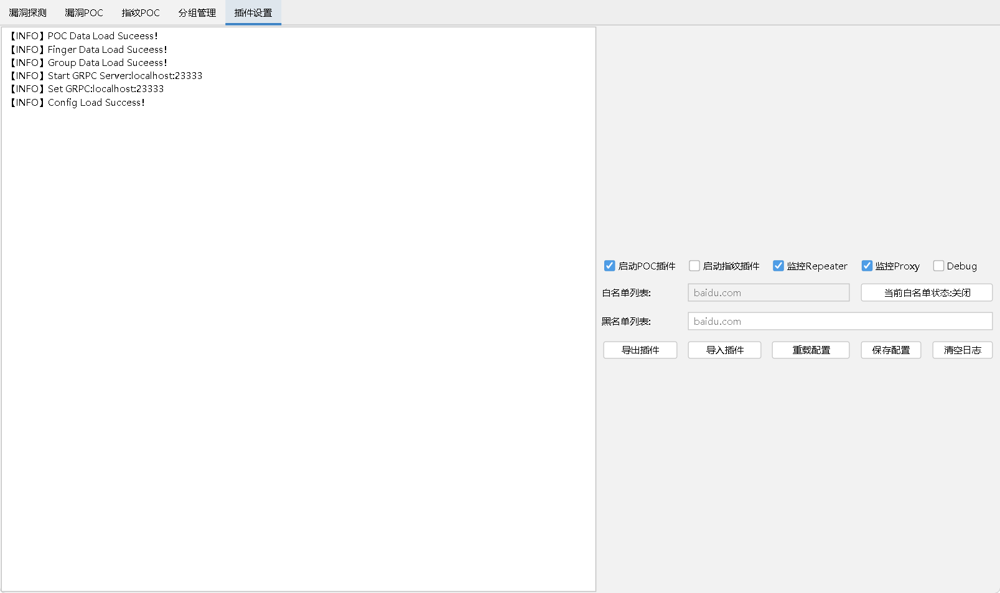

# FrameScan | burp插件
FrameScan插件是一款插件化的指纹POC扫描插件。

## 温馨提示

正常使用请关闭debug，不然可能会白屏哦~

## 工具使用

1、使用Burpsuit或者双击jar包。

2、启动后，请确保本地127.0.0.1:23333端口开放。如未开放，请手动启动rpc_server服务。Yaml Poc 、Python Poc依赖此组件。编译好的server已放到根目录。如不适用，请下载GRPC文件夹，使用`python rpc_server.py`启动rpc服务。

## 漏洞探测

burp发现的指纹及poc扫描结果会显示在此处。



## 漏洞poc




此模块支持4种POC类型如下：

### 简单HTTP请求

该POC会替换请求包中的字段，然后根据expression匹配规则进行漏洞探测。

```yaml
expression:
  match_method: Contain
  status_code: 200
  scope: response body
  match_value: openapi
requests:
  method: GET
  url: /v3/api-docs
  body: ''
```

### 高级 HTTP请求

该模块为源HTTP请求包，支持以下变量进行替换。

完整 URL：http://127.0.0.1:8080/aa/bb.txt

| 替换关键字               | 替换说明                     | 替换示例       |
| ------------------------ | ---------------------------- | -------------- |
| {{Host}}                 | 替换为请求包的Host字段       | 127.0.0.1:8080 |
| {{Random_UserAgent}}     | 替换为随机的User-Agent头     |                |
| {{Cookie}}               | 替换为源数据包的Cookie值     |                |
| {{Body}}                 | 替换为源数据包的Body值       |                |
| {{源数据包的任意请求头}} | 替换为源数据包的任意请求头值 |                |
| {{Base_Url}}             | 替换为请求相对地址           |                |
| {{Base_Path}}            | 替换为请求相对地址 的路径    |                |
| {{Url}}                  | 替换为完整 URL               |                |


```yaml
requests_raw: |
  GET / HTTP/1.1
  Host: {{Host}}
  Pragma: no-cache
  Cache-Control: no-cache
  User-Agent: {{Random_UserAgent}}
  Accept-Encoding: gzip, deflate
  Accept-Language: zh-CN,zh;q=0.9
  Connection: close
  Cookie: {{Cookie}}

  a=1{{Body}}
expression:
  match_method: Contain
  status_code: 22
  scope: response
  match_value: '22'
```

### Yaml Poc

该POC格式为FrameScan_Yaml的格式，插件可相互调用。请参考[FrameScan_Yaml插件编写](https://github.com/qianxiao996/FrameScan-Yaml/)，基础插件如下：

```yaml
#插件名称
name: poc-yaml-example-com
# 脚本部分
transport: http
rules:
  r1:
    request:
      method: GET
      path: /
      body: addd $num
      headers:
        Content-Type: application/json
    expression: |
      response.status_code==200 && operator.contains(response.text,'html')
    output:
      serial: re.search('\w+',response.text).group()
      html: re.search('refresh',response.text).group()
expression: r1() && r2()
#信息部分
detail:
  author: qianxiao996
  vuln_id: cve-2019-2222
  description: '111'
  group: 敏感信息泄露
  category: ALL
  links:
    - http://example.com
#全局变量
set:
  a: 1
  num: randint(1000, 2000)
```

###  Python Poc

该POC格式为FrameScan的格式，插件可相互调用。请参考[FrameScan插件编写](https://github.com/qianxiao996/FrameScan)，插件模板如下：

```python
# -*- coding: UTF-8 -*-
#!/usr/bin/python
import requests
def vuln_info():
    info={
        'vuln_name': 'POC测试漏洞',  #漏洞名称
        'vuln_referer':'http://baidu.com',  #漏洞来源
        'vuln_author':'qianxiao996',  #插件作者
        'cms_name':'test',#cms_name需要和上级目录保持一致。扫描器自动添加会调用。GUI版本不会调用
        'vuln_description':'''漏洞描述''',
        'vuln_identifier':'''漏洞编号。''',
        'vuln_class':'漏洞分类',#如：信息泄漏、远程命令执行、任意文件上传、SQL注入、XML注入、任意文件读取、本地文件包含、认证绕过/未认证、弱口令、目录遍历、其他、反序列化漏洞、OGNL表达式注入、SSRF、后门、任意文件下载、鉴权绕过、暴力破解、命令注入、路径泄露、XSS、远程文件包含、CSRF、任意文件包含、代码注入、任意文件写入、密码硬编码、文件包含、任意用户注册、缓冲区溢出、用户枚举漏洞、任意文件删除、任意页面上传、管理权限等
        'vuln_solution':'''修复建议。''',
        'FofaQuery_type':'socket', #socket、http
        'FofaQuery_link':'/', #此处的路径会加在url拼接访问，进行FofaQuery的条件匹配 此处为all为全部页面都检测
        'FofaQuery_rule':'title="百度"',#header="JSESSIONID" || body="Struts Problem Report" || body="There is no Action mapped for namespace" || body="No result defined for action and result input" || header="Servlet" || header="JBoss",port="60001"
        #header', 'body', 'title', 'banner','port','banner','service','protocol','server'
        'ispoc':1, #是否有poc  1为有 0为无
        'isexp':1  #是否有exp   1为有 0为无
    }
    return info
# url：url  hostname：主机地址  port：端口  scheme：服务  heads：http自定义头信息
def do_poc(url,hostname,port,scheme,heads={}):
    try:
    # 返回参数
    #Result返回是否存在，
    #Result_Info为返回的信息，可以为Paylaod 
    #Debug debug信息 默认不会显示，勾选显示调试信息会输出此结果
    #Error_Info无论何时都会输出
        result = {"Result":True,"Result_Info":"payload","Debug_Info":"","Error_Info":""}
        result['Result_Info']= 'payload'
        result['Debug_Info']  = 'ddd'
        result['Error_Info'] = "dsaaaaaaaa"
    except Exception as e:
        result['Error_Info'] = str(e)+str(e.__traceback__.tb_lineno)+'行'
    return result
    
    # {
    #     "type":"cmd",  #cmd,shell,uploadfile
    #     "command":"whoami",  #cmd命令
    #     "reverse_ip":"127.0.0.1", #反弹shell的ip
    #     "reverse_port":"8888", #反弹shell的端口
    #     "filename":"conf.php", #写入文件的名字
    #     "filename_contents":"shell内容", #shell文件内容
    # }
# url:url   hostname：主机地址  port：端口  scheme：服务  heads:自定义请求头 
```

## 指纹POC



指纹POC编辑



## 分组管理

启用漏洞POC：指纹匹配后，只有在此组的漏洞POC才会进行扫描。

跳过指纹POC：不进行指纹扫描。直接进行扫描的POC。




## 插件设置




## 配置文件介绍

```yaml
#是否启用代理
Is_Proxy: true
#是否启用Debug
Is_Debug: true
#是否开启白名单
WhiteEnable: false
#是否启用POC插件
Enable_Poc: true
#是否开启Repeater
Is_Repeater: true
#白名单域名列表 
WhiteList: baidu.com
#黑名单域名列表
BlackList: www.baidu.com
#是否启用指纹插件
Enable_Finger: true
#指纹扫描后，匹配的POC插件列表
EnablePocList: 高危漏洞,渗透测试,接口泄露,默认分组,信息泄露
#不进行指纹扫描，直接扫描的漏洞POC插件
DisenableFingerPocList: Yaml Poc测试,高级HTTP请求测试,Python  Poc测试
#GRPC ip地址
Grpc_Host: localhost
#GRPC 端口
Grpc_Port: 23333
#GUI主题，配置项：FlatDarkLaf、FlatIntelliJLaf、FlatLightLaf、FlatCyanLightIJTheme、FlatArcIJTheme、FlatArcOrangeIJTheme、FlatLightFlatIJTheme、FlatSolarizedLightIJTheme、FlatGitHubDarkIJTheme、FlatSpacegrayIJTheme、FlatVuesionIJTheme、FlatXcodeDarkIJTheme、FlatAtomOneDarkIJTheme、FlatGrayIJTheme、FlatArcDarkIJTheme、FlatArcDarkOrangeIJTheme、FlatCarbonIJTheme、FlatCobalt2IJTheme、FlatHighContrastIJTheme、FlatDarkFlatIJTheme、FlatDarkPurpleIJTheme、FlatDraculaIJTheme、FlatGradiantoDarkFuchsiaIJTheme、FlatGradiantoDeepOceanIJTheme、FlatGradiantoMidnightBlueIJTheme、FlatGradiantoNatureGreenIJTheme、FlatGruvboxDarkHardIJTheme
Themes: FlatIntelliJLaf

#系统+架构：系统配置项 windows|mac os x| linux  架构配置项：amd64|x86_64|amd64|arm|aarch64
Platform: windows 10:amd64

#简单请求替换插件模板
Simple_HTTP_Request: |
  methd: GET
  url: /ddd
  haders:
    - User-Agent: Mozilla/5.0 (Windows NT 10.0; Win64; x64) AppleWebKit/537.36 (KHTML, like Gecko) Chrome/126.0.0.0 Safari/537.36
  body: a=1

#Yaml Poc插件模板
Yaml_Poc: |
  name: poc-yaml-.DS_Store-info
  transport: http
  rules:
    r1:
      request:
        method: GET
        path: /.DS_Store
        headers:
          User-Agent: Mozilla/5.0 (Windows NT 10.0; Win64; x64) AppleWebKit/537.36 (KHTML, like Gecko) Chrome/119.0.0.0 Safari/537.36
      expression: |
        response.status_code==200
  output: "发现.DS_Store文件"
  expression: r1()
  detail:
    name: '.DS_Store文件泄露'
    author: qianxiao996
    category: 敏感信息泄露
    subassembly: ALL
    vuln_id: 无
    description: '.DS_Store文件泄露'
    links: []
#高级HTTP请求插件模板
Advanced_HTTP_Request: |
  GET / HTTP/1.1
  Host: {{Host}}
  Pragma: no-cache
  Cache-Control: no-cache
  User-Agent: {{Random_UserAgent}}
  Accept-Encoding: gzip, deflate
  Accept-Language: zh-CN,zh;q=0.9
  Connection: close
  Cookie: {{Cookie}}

  {{Body}}
#Python_Poc插件模板
Python_Poc: ""

```

